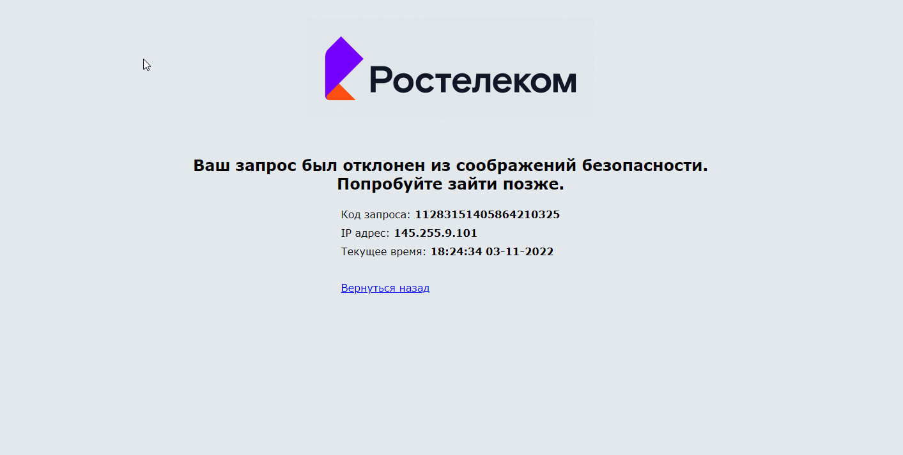

# SkillFactory: Тестировщик-автоматизатор на Python (QAP)
# Module_28- Итоговый проект по автоматизации тестирования

Функциональное тестирование сайта "Ростелеком" https://b2c.passport.rt.ru

Ссылка на тест-кейсы: 
https://docs.google.com/spreadsheets/d/1JarcfR9yHffVHUICSdtHamj6h07izlCnav0uEwirOCk/edit?usp=sharing

Файл base.py и elements.py использованы без изменения с 
https://github.com/ptaschka/28-Module_Final.git

Запуск тестов: python -m pytest -v --driver Chrome --driver-path chromedriver.exe tests/... имя файла.
Есть закомментирована строка в верху каждого файла.

IDE - PyCharm 2022.1.3
Версия chromedriver.exe для Google Chrome версия 107.

Файл test_authorization - 
Не возможно выполнить проверку на положительный тест авторизации по "Логину" и 
"Лицевому счету" они должны быть при регистрации их нет.
Не нашел решение как проверить что кнопка или текст поменяли цвет. 

Файл test_password_recovery - восстановление пароля по номеру телефона и
восстановление пароля по почте, автотесты остановлены на вводе 
"Капчи" - которую победить как? 

Файл test_registration - регистрация нового пользователя дополнительно хотелось реализовать: 
1. Ввод: Имя Фамилия латиницей, кириллицей, количество символов меньше двух,
больше двух, знак тире.
2. Ввод пароля, в требованиях большое количество вариантов.
3. Выбрать регион.
4. Ввод почты использовать виртуальный почтовый ящик с проверкой письма и ввода кода. 
5. Ввод телефона с проверкой кода.

Запросы временами блокировались:  

